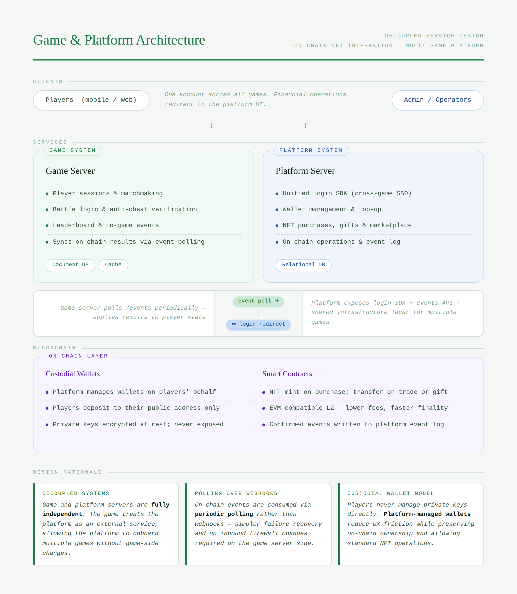
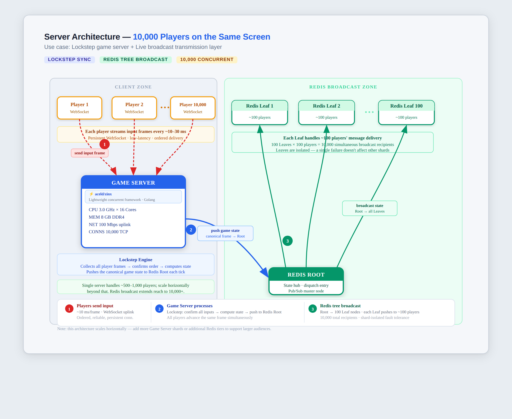
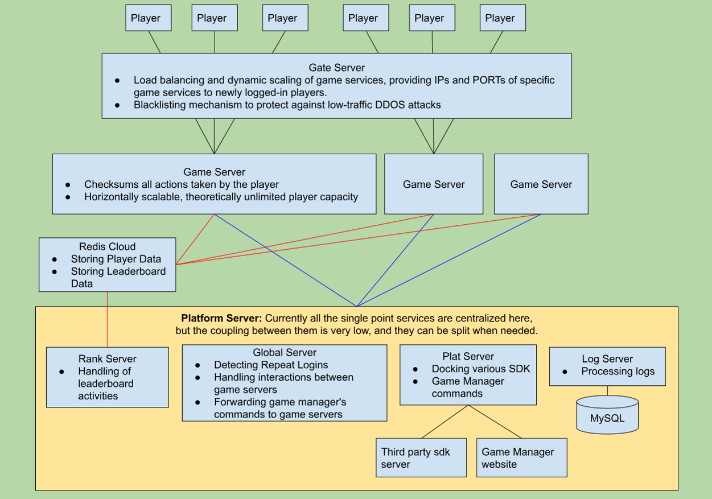
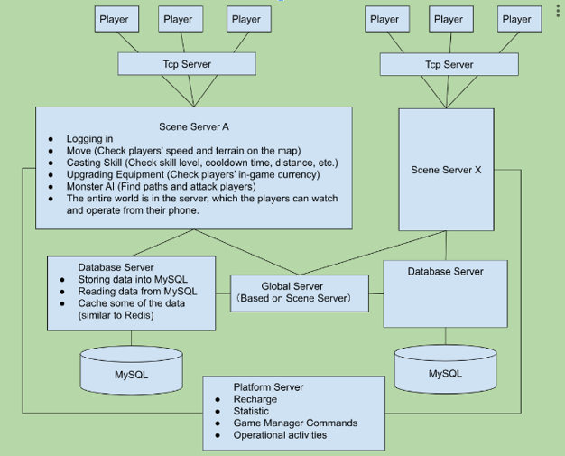

<div align="center">

<picture>
  <source media="(prefers-color-scheme: dark)" srcset="https://capsule-render.vercel.app/api?type=waving&color=0a1628&height=140&section=header&text=Eric%20(Guojie)%20Li&fontSize=38&fontColor=ffffff&fontAlignY=60&desc=Senior%20Backend%20Engineer%20%E2%80%94%20Go%20%C2%B7%20C%2B%2B%20%C2%B7%20AWS%20%C2%B7%20Blockchain&descAlignY=80&descSize=13&animation=fadeIn">
  
</picture>

</div>

<br/>

```
Go · C++ · AWS · Blockchain   |   10+ Years   |   Yokohama, Japan
```

Backend engineer with a decade of delivery across **online gaming**, **retail AI**, **blockchain**, and **enterprise IAM**.
I specialize in entering unfamiliar domains fast and shipping production-grade, highly scalable systems from scratch.

<br/>

---

## 📊 At a Glance

<div align="center">

|  10+ yrs  |  50K  |  10M  |  2 TB  |
|:---------:|:-----:|:-----:|:------:|
| Experience | Concurrent users / node | Registered players | Daily data processed |

</div>

<br/>

---

## 🛠️ Tech Stack

**Languages**


**Cloud & Infrastructure**


**Databases**


**Domains**


<br/>

---

## 💼 Experience

<details>
<summary><b>Backend Engineer</b> — Kyouka Co., Ltd., Yokohama &nbsp;·&nbsp; <code>Jul 2024 – Present</code></summary>
<br/>

**Shimizu Corp / Saviynt IAM** &nbsp;`Sep 2025 – Present`

Designed and owned all data-processing code. Built the full AWS pipeline from scratch — CDK (IaC), Step Functions state machines, a Lambda per processing stage — and delivered requirements → coding → testing → deploy solo.

`Python` `TypeScript` `AWS CDK` `Step Functions` `Lambda` `Saviynt`

---

**7-Eleven Japan AI Ordering System** &nbsp;`Jul 2024 – Aug 2025`

Continued development of the Python data pipelines powering a nationwide AI supply-chain platform deployed across 21,000+ stores.

`Python` `VBA` `Bash`

</details>

<details>
<summary><b>Lead Game Server Engineer</b> — Hangzhou Qingyu Network Technology &nbsp;·&nbsp; <code>Jul 2023 – Feb 2024</code></summary>
<br/>

**CUCKOO Blockchain Game Platform**

Built the Go backend (REST API, business logic, DB design, microservice integration) and designed an on-chain / off-chain hybrid settlement model: high-frequency trades batched off-chain for throughput; critical operations settled on-chain via smart contracts. Owned all server-side blockchain interaction.

`Go` `Node.js` `Ethereum` `Redis` `MongoDB` `MySQL`

---

**Fuss of Three Kingdoms**

Client-computed / server-validated combat: Lua server issues random seeds → client runs the battle simulation → Node.js validator replays it server-side to detect cheating.

`Go` `Lua (skynet)` `Node.js`

</details>

<details>
<summary><b>Lead Game Server Engineer</b> — Hangzhou Quweiyou Network Technology &nbsp;·&nbsp; <code>Sep 2021 – Apr 2023</code></summary>
<br/>

**HeHe Restaurant (Casual Online Game)**

Designed a 4-layer server architecture: **Gate** (load balancing, DDoS blacklisting) → **Game** (horizontally scalable logic) → **Global** (cross-server auth, leaderboards, GM relay) → **Platform** (SDK docking, ops tools). Stress-tested to **50K concurrent users / node**, **10M registered players**. Built a Redis storage layer that meaningfully reduced login latency.

`Go` `Redis` `Bash`

</details>

<details>
<summary><b>IT Engineer</b> — WISDOM JAPAN, Yokohama &nbsp;·&nbsp; <code>Mar 2018 – Jun 2021</code></summary>
<br/>

**7-Eleven Japan AI Ordering System**

Core data-processing module for **2+ TB of daily sales data** from 21,000 stores across Japan; later rolled out globally.

`Python` `pandas` `pytest`

---

**Nikkei QUICK Stock Page Migration**

Self-taught React from scratch and delivered the majority of the codebase in 3 months — the client's original estimate was 1 year.

`React` `Node.js`

</details>

<details>
<summary><b>C++ Game Server Engineer</b> — 7K7K, Beijing &nbsp;·&nbsp; <code>Jul 2014 – Jun 2017</code></summary>
<br/>

**Starlight Legend (MMORPG)** &nbsp;— [gameplay video ↗](https://youtu.be/Q-OZdoF_VGA)

One of three engineers who built this MMORPG from the ground up — **¥20M average monthly revenue** across China, Korea, Taiwan, Thailand, and Singapore. Designed the cross-server Global Service (shared-memory IPC). Owned most gameplay systems: event engine (hot-reload, refactored from one event per type / day-precision to multiple concurrent events at second-precision), skills, guilds, arena, NPC AI, shop, and leaderboards.

`C++` `MySQL` `Bash`

</details>

<br/>

---

## 🚀 Open Source

<div align="center">

[](https://github.com/aceld/zinx)
&nbsp;&nbsp;
[](https://github.com/LI-GUOJIE/AIGC-RPG-DEMO)

</div>

**zinx — Core Contributor** &nbsp;·&nbsp; [PR #231](https://github.com/aceld/zinx/pull/231): Rewrote the load balancer for high-concurrency game scenarios, achieving fair task distribution under load. &nbsp;`★ 7.7k` &nbsp;`1.1k forks`

**AIGC-RPG-DEMO** &nbsp;·&nbsp; Text-based RPG powered by generative AI, built to run on Google Colab. An experiment in LLM-driven game narrative.

<br/>

---

## 🗺️ Architecture Portfolio

> Real system designs from production. Click any diagram to open the full interactive version.

<br/>

<div align="center">

<table>
  <tr>
    <td align="center" width="480">
      <a href="https://htmlpreview.github.io/?https://github.com/LI-GUOJIE/LI-GUOJIE/blob/main/assets/3SystemDesign_Portfolio.html">
        
      </a>
      <br/><br/>
      <b>Blockchain Game Platform — Hybrid Settlement Architecture</b>
      <br/>
      <sub>Decoupled Game / Platform services · Custodial wallet management · On-chain NFT settlement &nbsp;|&nbsp; Go · Ethereum</sub>
      <br/>
      <sub><a href="https://htmlpreview.github.io/?https://github.com/LI-GUOJIE/LI-GUOJIE/blob/main/assets/3SystemDesign_Portfolio.html">↗ View interactive diagram</a></sub>
    </td>
    <td align="center" width="480">
      <a href="https://htmlpreview.github.io/?https://github.com/LI-GUOJIE/LI-GUOJIE/blob/main/assets/10000_people_server_design_v4.html">
        
      </a>
      <br/><br/>
      <b>High-Concurrency Multiplayer Server Design</b>
      <br/>
      <sub>Dynamic load balancing · Horizontally scalable game nodes · Anti-cheat validation · Cross-server coordination</sub>
      <br/>
      <sub><a href="https://htmlpreview.github.io/?https://github.com/LI-GUOJIE/LI-GUOJIE/blob/main/assets/10000_people_server_design_v4.html">↗ View interactive diagram</a></sub>
    </td>
  </tr>
  <tr>
    <td align="center" width="480">
      
      <br/><br/>
      <b>Horizontally Scalable Casual Game Server</b>
      <br/>
      <sub>4-Tier Architecture: Gate · Logic · Global · Platform &nbsp;|&nbsp; 50K concurrent users / node &nbsp;|&nbsp; Go · Redis</sub>
    </td>
    <td align="center" width="480">
      
      <br/><br/>
      <b>MMORPG Distributed Scene-Server Architecture</b>
      <br/>
      <sub>Multi-zone scene servers · Cross-server Global Service (IPC) · Per-zone DB sharding &nbsp;|&nbsp; C++ · MySQL</sub>
    </td>
  </tr>
</table>

</div>

<br/>

---

## 🎓 Education & Misc

- 🎓 **B.Eng.** Electronic Information Technology & Instrumentation — Hangzhou Dianzi University &nbsp;`2009–2013`
- 📜 Coursera Machine Learning & Deep Learning — [certificate ↗](https://coursera.org/account/accomplishments/certificate/CAT492NCEP52)
- 🏆 Outstanding Employee Award — 7K7K &nbsp;`Jan 2017`
- 🥈 2nd Prize, Zhejiang Provincial University Physics Competition &nbsp;`2011`

<br/>

---

## 🌍 Languages

🇨🇳 **Chinese** — Native &nbsp;&nbsp;|&nbsp;&nbsp; 🇯🇵 **Japanese** — JLPT N1 (5+ years in Japan) &nbsp;&nbsp;|&nbsp;&nbsp; 🇬🇧 **English** — CEFR B1, strong technical reading

<br/>

---

## 📬 Get in Touch

<div align="center">

[](mailto:imliguojie@gmail.com)
&nbsp;
[](https://www.linkedin.com/in/eric-guojie-li)
&nbsp;
[](https://github.com/LI-GUOJIE)
&nbsp;
[](#)

</div>

<br/>

<div align="center">
<sub><i>Always eager to tackle hard problems and explore new technologies. Open to global opportunities.</i></sub>
<br/><br/>

<picture>
  <source media="(prefers-color-scheme: dark)" srcset="https://capsule-render.vercel.app/api?type=waving&color=0a1628&height=80&section=footer">
  
</picture>
</div>
